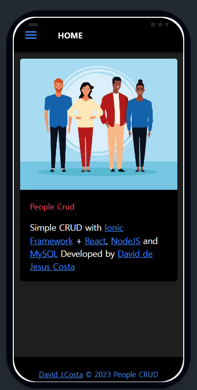
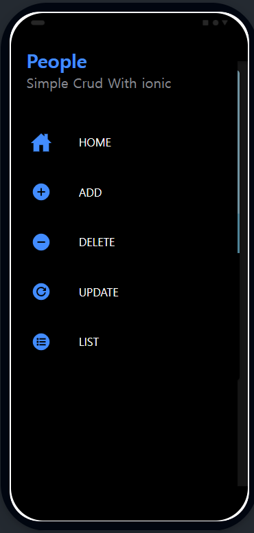
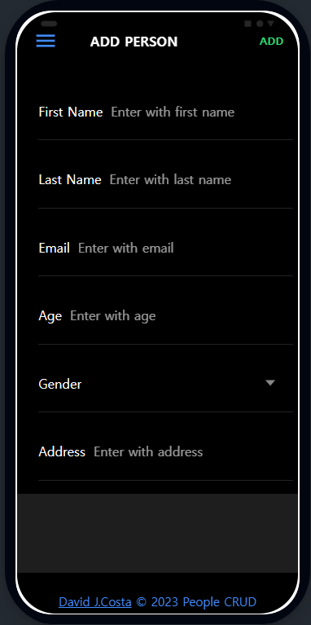
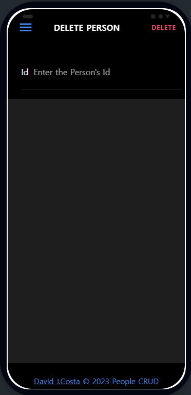
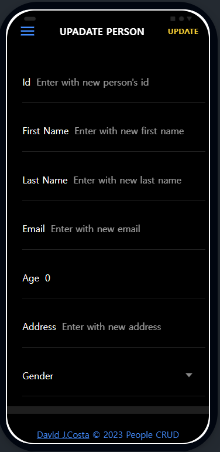
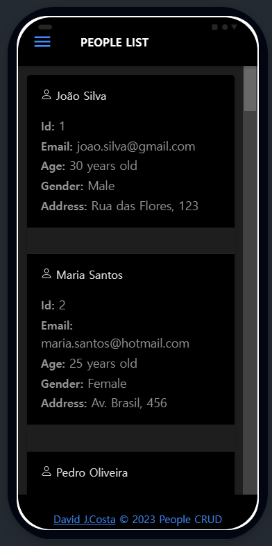

# Simple Aplication [Ionic](https://ionicframework.com/docs/react) [React TS](https://pt-br.legacy.reactjs.org/), [NodeJs](https://nodejs.org/en) and [MySQL](https://www.mysql.com/)

---

https://github.com/david-jc-br/crud_ionic_react_node_mysql/assets/73839667/b4de94c1-74ec-4cbe-8952-41b015a3f06d

---

### Home Page

---

### Side Menu

---

### Add Person Page

---

### Delete Person Page

---

### Update Person Page

---

### People List Page

